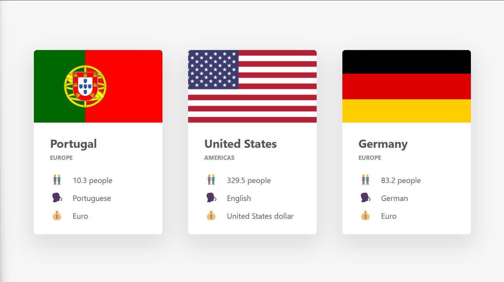

# Countries App

It shows us the information of any countries.

## Main Page



## Technologies

- Vite
- Vanilla JS
- HTML/CSS
- API: [Rest Countries](https://restcountries.com)

## Installation

- In root directory

via npm:
```bash
> npm install
```

via yarn:
```bash
> yarn
```

- Run project

via Vite:

```sh
> vite
```

via yarn or npm
```sh
> yarn dev <OR> npm run dev
```